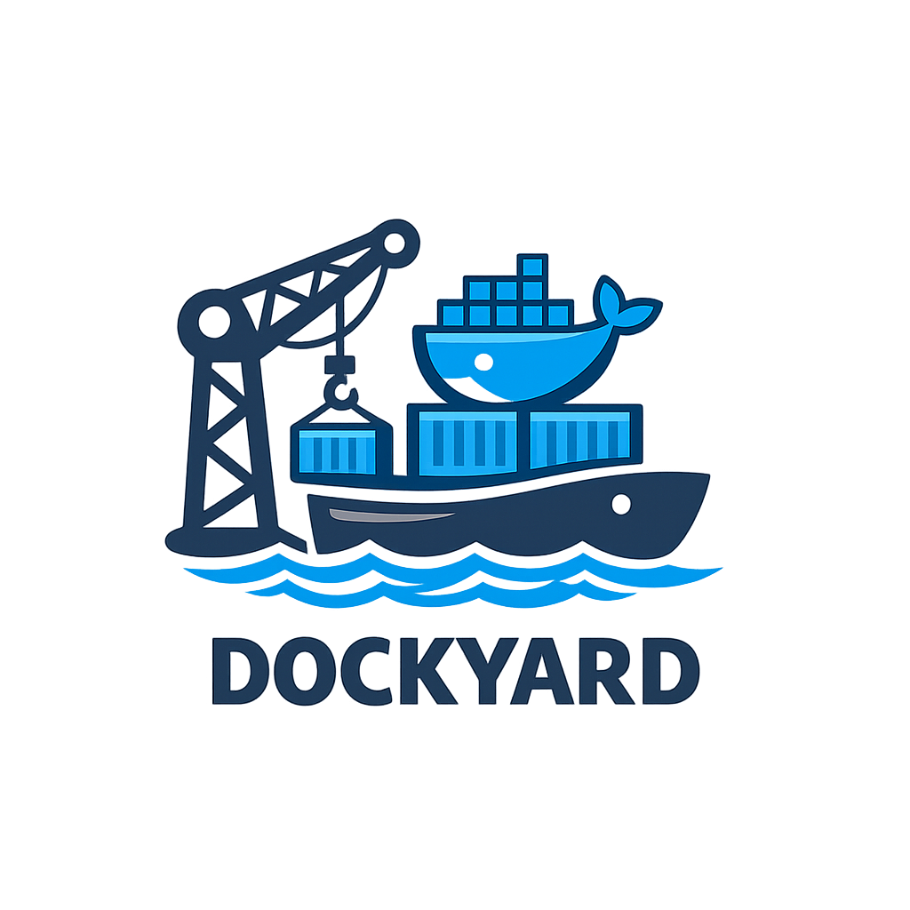

Webbasiertes Dashboard zur Verwaltung von Docker Containern auf dem Host.

### Tech Stack

- **Frontend:** React, TypeScript, ReactQuery 
- **Backend:** Express, TypeScript, Dockerode

### Voraussetzungen

- [Docker](https://docs.docker.com/get-docker/) und [Docker Compose](https://docs.docker.com/compose/install/)
- Für lokale Entwicklung: [Node.js](https://nodejs.org/) (v22+)

### Starten mit Docker Compose

```bash
docker compose up --build
```

### API
| Methode | Endpunkt                       | Beschreibung          |
|---------|--------------------------------|-----------------------|
| GET     | /containers                    | Alle Container listen |
| GET     | /containers?name=foo           | Nach Name filtern     |
| GET     | /containers?status=running     | Nach Status filtern   |
| POST    | /containers/:containerId/start | Container starten     |
| POST    | /containers/:containerId/stop  | Container stoppen     |


### ⚠️ Sicherheitshinweis
Diese Anwendung benötigt Zugriff auf den Docker Socket (/var/run/docker.sock), um Container auf dem Host-System zu verwalten. Dadurch erhält die Anwendung vollständige Kontrolle über den Docker Daemon, was einem Root-Zugriff auf den Host entspricht.
